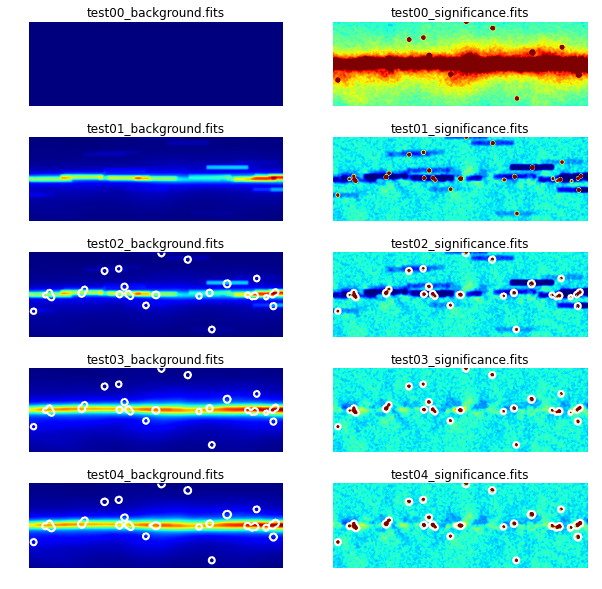

Background Estimation
=====================

Here we introduce a background estimation method based on significance clipping.

Significance Clipping
---------------------
TODO: Add a link to the proceeding, and summarise here the method & intro from
the proceeding.

The algorithm is demonstrated in the example below, where it is applied to
the galactic center region. 5 iterations are forced here - although it is clear
the result becomes stable quickly, after which point the algorithm would
usually end and return the estimation.

.. plot:: tutorials/background/source_diffuse_estimation.py
	:include-source:
	
The source mask is shown by the white contours. This includes the regions
excluded above the 4 sigma significance threshold in computing the background
estimation images above.

